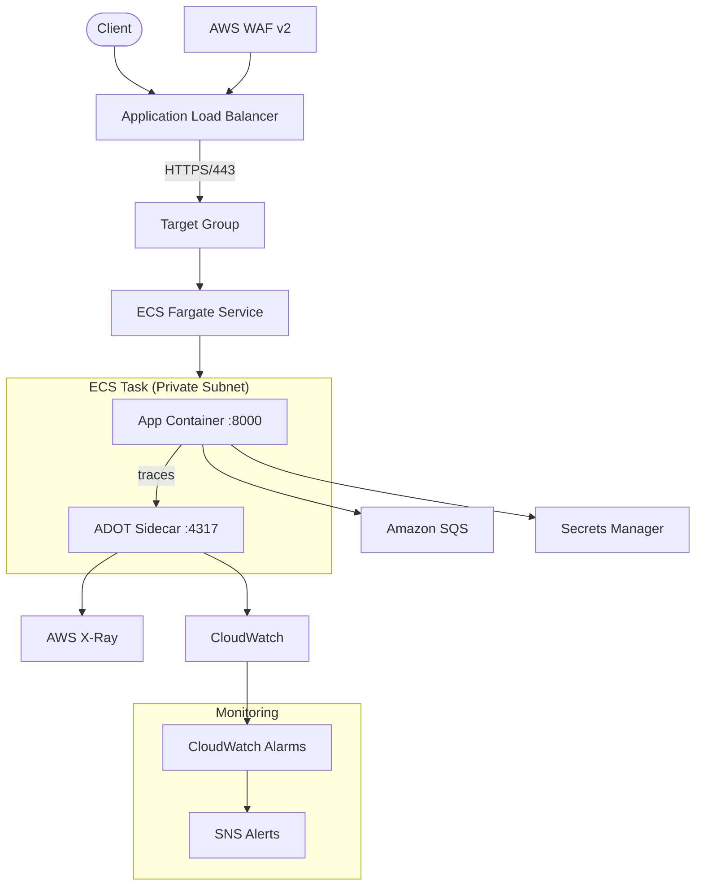

# Architecture Documentation

## Design Principles
1. **Security First**: Zero-trust networking, least-privilege IAM, encrypted secrets
2. **Availability**: Multi-AZ deployment with auto-scaling and circuit breakers
3. **Observability**: Structured logging, distributed tracing via OpenTelemetry/ADOT
4. **Infrastructure as Code**: All resources managed via Terraform with remote state

## Component Architecture

## Infrastructure Layers

### Networking
- **VPC**: Isolated per environment (dev/staging/prod) with unique CIDR ranges
- **Subnets**: Public (ALB) + Private (ECS tasks) across 2 AZs
- **NAT Gateways**: Per-AZ for HA outbound from private subnets

### Compute
- **ECS Fargate**: Serverless containers with auto-scaling (CPU + memory targets)
- **Circuit Breaker**: Automatic rollback on failed deployments
- **ADOT Sidecar**: OpenTelemetry collector for distributed tracing

### Security
- **WAF v2**: OWASP Common Rules, Bad Input protection, IP rate limiting
- **HTTPS**: TLS 1.3 via ACM certificate
- **IAM**: Least-privilege policies scoped to specific resource ARNs
- **ECR**: Immutable image tags, vulnerability scanning on push
- **Secrets Manager**: Application secrets managed out-of-band

### CI/CD
- **PR Pipeline**: Lint (Ruff) → Tests (pytest) → Terraform validate → Docker build → Trivy scan
- **Deploy Pipeline**: Build → SBOM → Cosign sign → ECR push → Task def update → ECS deploy

### Observability
- **Logging**: Structured JSON → CloudWatch Logs (30-day retention)
- **Tracing**: OpenTelemetry → ADOT → AWS X-Ray
- **Alarms**: CPU/Memory/5xx/Error rate → SNS notifications
- **Metrics**: Application `/metrics` endpoint

## Environment Strategy

| Environment | VPC CIDR | ECS Tasks | WAF | Monitoring | HTTPS |
|---|---|---|---|---|---|
| dev | 10.1.0.0/16 | 1–3 | ❌ | ❌ | ❌ |
| staging | 10.2.0.0/16 | 1–5 | ✅ | ✅ | Optional |
| prod | 10.0.0.0/16 | 2–10 | ✅ | ✅ | ✅ |
