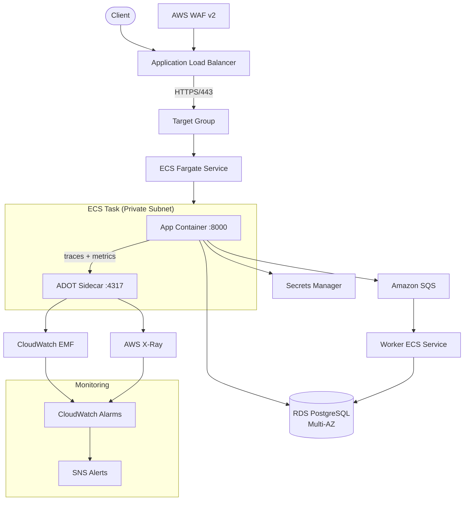

# Architecture Documentation

## Design Principles

| Principle | Implementation |
|---|---|
| **Security First** | Zero-trust networking, least-privilege IAM, encrypted secrets, private-only ECS subnets |
| **Availability** | Multi-AZ deployment, auto-scaling, deployment circuit breakers, health check grace periods |
| **Observability** | Structured logging, distributed tracing via OpenTelemetry/ADOT, CloudWatch EMF metrics |
| **Infrastructure as Code** | All resources managed via modular Terraform with encrypted remote state |
| **Cost Optimization** | VPC endpoints eliminate NAT traversal cost for AWS API calls; FARGATE_SPOT for non-critical tasks |

---

## End-to-End Request Flow

```
Internet
   │
   ▼
[Optional CloudFront + WAF v2]
   │   HTTPS/TLS 1.3, DDoS protection, OWASP rules, IP rate limiting
   ▼
[Application Load Balancer] (Public Subnet, Multi-AZ)
   │   HTTPS:443 → Target Group health check
   │   HTTP:80  → 301 redirect to HTTPS
   ▼
[ECS Fargate Task] (Private Subnet, no public IP)
   │  ┌──────────────────────────────────────┐
   │  │ App Container (:8000)                │
   │  │   - FastAPI / application logic      │
   │  │   - Emits OTLP traces to localhost   │
   │  │   - Publishes messages to SQS        │
   │  │   - Reads secrets from SSM/SM        │
   │  │                                      │
   │  │ ADOT Sidecar (:4317 gRPC, :4318 HTTP)│
   │  │   - Receives OTLP from app           │
   │  │   - Exports traces → X-Ray           │
   │  │   - Exports metrics → CloudWatch EMF │
   │  └──────────────────────────────────────┘
   │
   ├──[SQS Queue]──► Worker ECS Task (async processing)
   │                   │
   │                   ├── Back-pressure: SQS depth drives autoscaling
   │                   ├── Retry: visibility timeout + max receive count
   │                   └── DLQ: messages after N retries stored for inspection
   │
   ├──[RDS PostgreSQL] (Private Subnet, Multi-AZ)
   │     - App writes via DATABASE_URL env var
   │     - Worker reads/writes for async jobs
   │     - Multi-AZ synchronous replication
   │
   └──[VPC Endpoints] (all AWS API calls stay private, no NAT traversal)
         ECR API/DKR, S3, CloudWatch Logs, SSM, Secrets Manager, X-Ray, SQS
```

**Latency budget (typical p99):**

| Hop | Expected latency |
|---|---|
| Client → ALB (TLS handshake) | 5–15 ms |
| ALB → ECS target group | 1–3 ms |
| App processing | 20–150 ms |
| App → SQS publish | 2–5 ms (async, non-blocking) |
| App → RDS query | 1–10 ms (private subnet, same AZ) |
| Total API response | < 200 ms p99 |

---

## Failure Scenarios & Platform Response

### 1. ECS Task Unhealthy — ALB Health Check Failure

```
ALB sends /health probe every 30s
  → 3 consecutive failures (90s)
    → ALB marks target InService:false
    → ECS detects task is not serving traffic
    → ECS replaces task (new task registered, old deregistered)
    → ALB routes to healthy replacement
    → CloudWatch alarm fires if running task count < desired
    → SNS alert sent to on-call
```

**Grace period:** `health_check_grace_period_seconds = 60` prevents premature termination during container startup.

### 2. SQS Message Processing Failure — Retry + DLQ

```
Worker fails to process message
  → Message becomes visible again after visibility_timeout
  → Worker retries (up to max_receive_count = 3)
    → On 3rd failure: message moved to Dead Letter Queue (DLQ)
    → CloudWatch alarm: ApproximateNumberOfMessagesNotVisible > threshold
    → SNS alert fired → engineer investigates DLQ
    → Engineer replays messages after fix: aws sqs send-message-batch
```

**Key tuning parameters:**
- `visibility_timeout`: must be > max task processing time (set to 300s)
- `max_receive_count`: 3 retries before DLQ
- `message_retention_period`: 14 days in DLQ for investigation window

### 3. Failed Deployment — ECS Deployment Circuit Breaker

```
New task definition pushed → ECS starts rolling deployment
  → New tasks launched alongside existing tasks (deployment_maximum_percent = 200)
  → ALB health checks run against new tasks
    → If new tasks fail health checks consistently:
      → Circuit breaker trips
      → ECS automatically rolls back to last stable task definition
      → Deployment marked FAILED in ECS console
      → CloudWatch event emitted → SNS alert
    → If healthy: old tasks drained and terminated
```

**Rollback is automatic.** No manual intervention required for transient failures.

**Manual rollback** (emergency):
```bash
# Find last stable task definition revision
aws ecs describe-services --cluster <cluster> --services <service> \
  --query 'services[0].taskDefinition'

# Force rollback
aws ecs update-service --cluster <cluster> --service <service> \
  --task-definition <family>:<previous-revision> \
  --force-new-deployment
```

### 4. Infrastructure-Level Failure — AZ Outage

```
AZ fails (e.g., us-east-1a)
  → NAT Gateway in failed AZ becomes unreachable
  → ECS scheduler stops placing tasks in that AZ
  → ALB routes only to tasks in healthy AZs
  → Auto-scaling (if needed) launches replacement tasks in healthy AZs
  → VPC endpoints remain available (they're regional)
  → RDS fails over to standby replica in another AZ (1–2 min)
```

---

## Scaling Strategy

### ECS CPU / Memory Autoscaling (Reactive)

Target tracking policies run independently:

| Metric | Target | Scale-out cooldown | Scale-in cooldown |
|---|---|---|---|
| ECSServiceAverageCPUUtilization | 70% | 60s | 300s |
| ECSServiceAverageMemoryUtilization | 80% | 60s | 300s |

- **Scale-out is fast** (60s cooldown) — we can absorb traffic spikes quickly.
- **Scale-in is conservative** (300s cooldown) — prevents thrashing under oscillating load.
- Min capacity = 2 (always HA). Max capacity = 10 (cost ceiling).

### Queue-Depth Autoscaling (Predictive for Workers)

Worker ECS services scale on SQS depth using a custom CloudWatch metric:

```
ApproximateNumberOfMessagesVisible / RunningTasks > threshold → scale out
ApproximateNumberOfMessagesVisible == 0 for cooldown period → scale in
```

This gives a **work-driven** scaling model: workers scale proportionally to backlog, not CPU, ensuring consistent processing throughput without over-provisioning.

### FARGATE_SPOT Cost Optimization

Capacity provider strategy:
- **Base load** → `FARGATE` (100% guaranteed, for min_capacity tasks)
- **Burst / scale-out tasks** → `FARGATE_SPOT` (up to 70% cheaper, with interruption handling)

Stateless tasks tolerate Spot interruptions because SQS ensures no work is lost — if a Spot task is reclaimed mid-processing, the SQS visibility timeout expires and the message is re-queued.

---

## Component Architecture


```mermaid
graph TD
    User([Client]) --> ALB[Application Load Balancer]
    WAF[AWS WAF v2] --> ALB
    ALB -->|HTTPS/443| TG[Target Group]
    TG --> ECS[ECS Fargate Service]

    subgraph ECS_Task ["ECS Task (Private Subnet)"]
        App[App Container :8000]
        ADOT[ADOT Sidecar :4317]
        App -->|traces + metrics| ADOT
    end

    ECS --> ECS_Task
    ADOT --> XRay[AWS X-Ray]
    ADOT --> CW[CloudWatch EMF]
    App --> SQS[Amazon SQS]
    SQS --> Worker[Worker ECS Service]
    App --> RDS[(RDS PostgreSQL\nMulti-AZ)]
    Worker --> RDS
    App --> SM[Secrets Manager]

    subgraph Monitoring
        CWAlarms[CloudWatch Alarms]
        SNS[SNS Alerts]
        CWAlarms --> SNS
    end

    CW --> CWAlarms
    XRay --> CWAlarms
```

---

## Infrastructure Layers

### Networking — Private-First Architecture

All compute runs in **private subnets** with no public IPs. AWS API calls (ECR, S3, CloudWatch, SSM, Secrets Manager, X-Ray, SQS) route through **VPC Interface Endpoints** — they never traverse the internet or NAT gateways. This means:

1. **Security**: No path from private subnets to the internet for AWS API traffic.
2. **Cost**: VPC endpoint calls are free (no NAT data processing fee of $0.045/GB).
3. **Latency**: Sub-millisecond AWS API calls within the AWS private network.

**NAT Gateway strategy:**

```
dev environment:   1 NAT Gateway (single AZ, save cost; downtime acceptable)
staging:           1 NAT Gateway (single AZ)
prod:              1 NAT Gateway per AZ (HA — failure of one AZ NAT doesn't affect other AZ tasks)
```

> **Tradeoff:** Multi-AZ NAT costs ~$65/month per gateway. For production, the availability guarantee justifies the cost. For dev/staging, single NAT saves ~$65/month with acceptable single-AZ risk.

**VPC Endpoints deployed:**

| Endpoint | Type | Purpose |
|---|---|---|
| `ecr.api` | Interface | ECR image pull auth |
| `ecr.dkr` | Interface | ECR image layer pull |
| `s3` | Gateway | ECR layer storage, Terraform state |
| `logs` | Interface | CloudWatch Logs (app + ADOT) |
| `ssm` | Interface | SSM Parameter Store (ADOT config) |
| `secretsmanager` | Interface | Application secrets |
| `xray` | Interface | Distributed traces |
| `sqs` | Interface | Queue operations |

### Compute

- **ECS Fargate**: Serverless containers — no EC2 management, no patch surface.
- **Capacity Providers**: FARGATE (base) + FARGATE_SPOT (scale-out burst, ~70% cheaper).
- **Circuit Breaker**: Automatic rollback on failed deployments.
- **ADOT Sidecar**: OpenTelemetry collector — decoupled from app, sidecars upgrades independently.
- **Health Check Grace Period**: 60s allows containers to finish startup before health checks count.

### Security

- **WAF v2**: OWASP Common Rules, Bad Input protection, IP rate limiting (2000 req/5min/IP).
- **HTTPS**: TLS 1.3 via ACM certificate on ALB.
- **IAM**: Least-privilege policies scoped to specific resource ARNs.
- **ECR**: Immutable image tags in prod, vulnerability scanning on push.
- **Secrets Manager**: Application secrets managed out-of-band, never in Terraform state.
- **Runtime**: Read-only root filesystem, non-root user, dropped Linux capabilities.

### CI/CD

- **PR Pipeline**: Lint (Ruff) → Tests (pytest) → Terraform validate → tfsec → Docker build → Trivy scan
- **Deploy Pipeline**: Build → SBOM → Cosign sign → ECR push → Task def update → ECS rolling deploy
- **OIDC**: GitHub Actions → AWS STS (no static credentials anywhere)

### Observability

- **Logging**: Structured JSON → CloudWatch Logs (30-day retention, KMS encrypted)
- **Tracing**: OpenTelemetry → ADOT → AWS X-Ray (trace_id propagated across services)
- **Metrics**: CloudWatch EMF (embedded metric format) via ADOT for zero-cost custom metrics
- **Alarms**: CPU/Memory/5xx/Error rate/SQS depth → SNS notifications

---

## Environment Strategy

| Environment | VPC CIDR | ECS Tasks | WAF | HTTPS | RDS | NAT AZs |
|---|---|---|---|---|---|---|
| dev | 10.1.0.0/16 | 1–3 | ❌ | ❌ | Optional | 1 |
| staging | 10.2.0.0/16 | 1–5 | ✅ | Optional | Optional | 1 |
| prod | 10.0.0.0/16 | 2–10 | ✅ | ✅ | ✅ Multi-AZ | Per-AZ |

---

## Architecture Decision Records

ADRs are stored in [`docs/adr/`](adr/) and document key decisions including:
- Why ECS Fargate over EKS (for greenfield workloads)
- Why ADOT sidecar over direct SDK instrumentation
- Why VPC endpoints over NAT-only
- Why OIDC over IAM access keys

---

## Compute Abstraction Layer

The platform supports two interchangeable compute backends, selectable per environment via `compute_platform` in `*.tfvars`.

```
compute_platform = "ecs"   # Default — ECS Fargate
compute_platform = "eks"   # Alternative — EKS Managed Nodes
```

### Shared Infrastructure (always provisioned)

These resources are compute-platform-agnostic. Switching from ECS to EKS does not destroy them:

| Resource | Module | Purpose |
|---|---|---|
| VPC + Subnets | `vpc` | Common private/public network fabric |
| VPC Endpoints | `vpc_endpoints` | Private AWS API access (ECR, S3, SSM, etc.) |
| ECR Repository | `ecr` | Container image registry — same image runs on ECS and EKS |
| SQS Queue | `sqs` | Async message queue — both compute platforms connect to same queue |
| Secrets Manager | `secrets` | Application secrets — ECS reads them as env vars; EKS via ESO |
| IAM (GitHub OIDC) | `iam` | CI/CD deploy role — used by both deployment paths |
| RDS PostgreSQL | `rds` | Database — both platforms connect over private networking |

### Compute-Specific Infrastructure

| Resource | ECS | EKS |
|---|---|---|
| Compute | ECS Fargate tasks (no EC2 instances) | EC2 managed node group (t3.medium–t3.large) |
| Autoscaling | ECS Application Auto Scaling (CPU + memory target tracking) | HPA (CPU + memory) + Cluster Autoscaler |
| Ingress | Application Load Balancer (Terraform-managed) | ALB per K8s Ingress (AWS Load Balancer Controller) |
| IAM for workloads | ECS task role | IRSA — per-pod IAM via K8s ServiceAccount |
| Secrets injection | ECS secrets (Secrets Manager → task env) | External Secrets Operator → K8s Secret → pod env |
| Observability | ADOT sidecar container in task definition | ADOT sidecar container in pod spec |
| Monitoring module | CloudWatch alarms on ECS cluster | Container Insights + CloudWatch alarms on node group |

### ECS vs EKS Decision Framework

**Choose ECS when:**
- Single-team, single-service platform (< 15 services)
- Team has no Kubernetes expertise
- You want minimal operational surface area
- No multi-tenancy or complex scheduling requirements
- Time to first deployment is a priority

**Choose EKS when:**
- Multi-team platform (each team may need own namespace + RBAC)
- Complex scheduling needed (GPU nodes, spot node pools, topology constraints)
- Kubernetes ecosystem tools needed (Argo CD, Argo Workflows, Istio, Kyverno)
- Portability is required (same manifests can run on GKE, AKS, on-premises)
- Service mesh (mTLS between all services) is a requirement

### EKS Request Flow (Kubernetes Path)

```
Internet
   │
   ▼
[AWS WAF v2] (optional, via Ingress annotation)
   │
   ▼
[AWS ALB] (created by AWS Load Balancer Controller from Ingress CR)
   │   HTTPS:443 → TLS terminated at ALB (ACM certificate)
   │   HTTP:80   → 301 redirect to HTTPS
   ▼
[Kubernetes Ingress] (alb.ingress.kubernetes.io/)
   │   target-type: ip — routes directly to pod IPs
   ▼
[Service: ClusterIP] (api-service namespace)
   │   Port 80 → Pod port 8000
   ▼
[Pod: api-service]
   │  ┌──────────────────────────────────────────────────┐
   │  │ Container: api-service (:8000)                   │
   │  │ - non-root UID 65534                             │
   │  │ - readOnlyRootFilesystem: true                   │
   │  │ - cap_drop: ALL                                  │
   │  │ - IRSA: assumes api-service IAM role             │
   │  │                                                  │
   │  │ Container: adot-collector (:4317)                │
   │  │ - receives OTLP from app via localhost           │
   │  │ - exports traces → X-Ray                         │
   │  │ - exports metrics → CloudWatch EMF               │
   │  └──────────────────────────────────────────────────┘
   │
   ├──► SQS Queue (via IRSA — no credentials in pod)
   └──► RDS PostgreSQL (private subnet — url from K8s Secret via ESO)
```

### Kubernetes Secrets Flow (ESO Path)

```
AWS Secrets Manager
   │  Secret: /{project}/{env}/app-secrets
   │  Value:  {"DATABASE_URL": "...", "SQS_QUEUE_URL": "..."}
   │
   ▼  ESO reads via IRSA (external-secrets IAM role)
External Secrets Operator Pod (external-secrets namespace)
   │  Watches ExternalSecret CRs in all namespaces
   │  Polls Secrets Manager every refreshInterval (default: 1h)
   │
   ▼  Creates/updates
Kubernetes Secret: api-service-secrets (api-service namespace)
   │  Data: DATABASE_URL, SECRET_KEY, SQS_QUEUE_URL
   │
   ▼  Mounted as env vars
Pod: api-service
   │  env:
   │    - name: DATABASE_URL
   │      valueFrom: secretKeyRef: ...
   │
   ▼
Application reads os.environ["DATABASE_URL"] — never touches AWS directly
```

---

## Failure Validation & Self-Healing

The EKS platform is designed to recover automatically from common failure scenarios.

### Scenario 1: Pod Crash / OOMKill
- **Detection**: Kubernetes Liveness/Readiness probes.
- **Action**: Kubelet restarts the container immediately.
- **Guarantee**: If restarts fail, the Deployment controller recreates the pod on a healthy node.

### Scenario 2: Node Failure / Spot Interruption
- **Detection**: Karpenter SQS interruption handler + EventBridge.
- **Action**: Karpenter pro-actively cordons the node and drains pods to new instances.
- **Guarantee**: Pod Disruption Budget (PDB) ensures `minAvailable: 1` during the move.

### Scenario 3: Traffic Spike (Scale-out)
- **Detection**: HPA monitors CPU/Memory thresholds.
- **Action**: HPA increases replica count; Karpenter provisions additional nodes if capacity is exhausted.
- **Guarantee**: Horizontal scaling prevents resource saturation.

---

## Disaster Recovery (DR) Strategy

Our DR strategy follows a **Multi-Region Pilot Light** or **Backup & Restore** pattern depending on the RTO/RPO requirements.

### Principles:
1. **Stateless Compute**: EKS clusters are treated as ephemeral. All cluster configuration is in Git (Infrastructure as Code).
2. **External State**: All persistent data is stored in RDS (Postgres), S3, or DynamoDB — never on Kubernetes worker nodes.
3. **Cluster Recreation**: In a total region failure, the entire foundation (VPC, EKS) can be redeployed via Terraform in a secondary region.
4. **Data Replication**: RDS Cross-Region Read Replicas are used for data durability.

### Backup Tools:
- **Velero**: Optionally used for cluster-level resource backups (CRDs, secrets, namespaces) to S3.
- **KMS**: All backups are encrypted using regional KMS keys.

---

## Upgrade Strategy (Zero-Downtime)

We maintain a "N-1" versioning strategy for EKS clusters to ensure stability while staying current.

### EKS Version Upgrades:
- **Control Plane**: Upgraded via Terraform (`kubernetes_version` variable). AWS handles the rolling update of the control plane API.
- **Data Plane (Managed Nodes)**: EKS Managed Node Groups use a rolling update strategy (one node at a time).
- **Data Plane (Karpenter)**: Nodes are cycled automatically via `expireAfter: 720h` or by updating the `EC2NodeClass` AMI.

### Availability Guards:
- **Pod Disruption Budget (PDB)**: Prevents the eviction of too many pods simultaneously during node upgrades.
- **Anti-Affinity**: Ensures replicas are spread across multiple nodes and Availability Zones.
- **MaxSurge / MaxUnavailable**: Deployment strategy tuned for zero-downtime rolling updates.


---

## Node Scaling Strategy (EKS)

EKS uses a **two-layer autoscaling architecture**. Both layers are required for a complete production system:

### Layer 1: HPA — Pod Autoscaling

HPA (Horizontal Pod Autoscaler) answers: **"How many pods should this deployment have?"**

```
Pod CPU > 70%  OR  Pod Memory > 80%
  → HPA controller detects metric threshold breach
    → HPA increases Deployment replicas
      → New pods created → Kubernetes scheduler looks for a node
        → If no node has capacity:
            → Pod stuck in "Pending" state
              → Karpenter detects Pending pod and provisions a node
```

HPA is reactive to **application-level demand**. It operates at the Kubernetes object level.

### Layer 2: Karpenter — Node Autoscaling

Karpenter answers: **"How many/what type of EC2 nodes should the cluster have?"**

```
Pod enters Pending state (unschedulable)
  → Karpenter scans the Pending pod's resource requests
    → Karpenter queries EC2 for cheapest available instance
       that fits the pod's CPU/memory/zone/capacity-type requirements
        → EC2 instance launched (< 60 seconds typically)
          → Node joins cluster via bootstrap script
            → Pod scheduled on new node
              → Service resumes normal operation
```

**Scale-in (Consolidation):**
```
Node CPU + memory utilization drops
  → Karpenter consolidation checks: can pods fit on other nodes?
    → Yes: cordon node → drain pods → terminate EC2 instance → cost eliminated
    → No: leave node running
```

### Why Karpenter over Cluster Autoscaler?

| Capability | Cluster Autoscaler | Karpenter |
|---|---|---|
| **Scale-out speed** | 5–15 min (ASG cooldowns) | < 60 seconds (direct EC2 API) |
| **Instance flexibility** | Fixed types in ASG config | Any type from allowed families at launch |
| **Spot interruption** | Cordons node on CloudWatch event | Proactive drain via SQS 2-min warning |
| **Node consolidation** | ❌ Doesn't merge underutilized nodes | ✅ Bin-packs pods, terminates underutilized nodes |
| **Cost optimization** | Scale out/in only | Right-sizes + eliminates idle capacity |
| **AMI management** | Static AMI in launch template | Dynamic SSM resolution (always patched) |

### Spot Interruption Handling (Karpenter)

```
AWS sends 2-minute Spot interruption warning
  → EC2 Spot Interruption Warning event → EventBridge
    → SQS queue (karpenter-interruption)
      → Karpenter controller receives message
        → Cordon node (no new pods)
          → Drain node (evict pods gracefully)
            → Pod eviction triggers PDB check
              → PDB ensures minAvailable=1 pods remain
                → New pod scheduled on another node/Spot instance
                  → EC2 terminates original instance
```

**This flow eliminates the main Spot risk**: without Karpenter's interruption handler, Spot terminations are sudden with no graceful pod shutdown.


